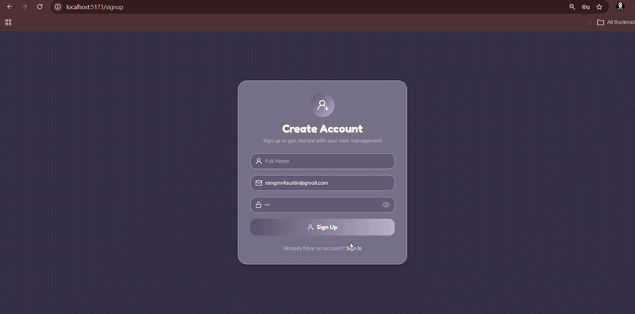

# kLab Tech Upskill Program — Full-Stack Coding Challenge 2026
## Task Management System

A full-stack, responsive Task Management web application built for the **kLab Tech Upskill Program** selection process.

---

##  Application Demo

<div align="center">
  
</div>

---

## Live Demo & Submission Details

* **Live Web Application**: [https://klab-tech-upskill-coding-challenge-2026.onrender.com/](https://klab-tech-upskill-coding-challenge-2026.onrender.com/)
* **Live REST API Backend**: [https://klab-task-backend.onrender.com](https://klab-task-backend.onrender.com)
* **GitHub Repository**: [https://github.com/AROSTA-MOSTER/klab-tech-upskill-coding-challenge-2026](https://github.com/AROSTA-MOSTER/klab-tech-upskill-coding-challenge-2026)

---

1. **Complete Task Lifecycle (CRUD)**:
   * **Create**: Add new tasks with title, description, priority, due date, and initial status.
   * **Read**: View all tasks or single task details via dashboard and dedicated views.
   * **Update**: Edit task details, adjust due dates, or modify priority levels anytime.
   * **Delete**: Remove tasks with one-click instant confirmation.

2. **Smart Status Management (Pending / Completed)**:
   * **Bidirectional Status Toggling**: Mark tasks as **Completed** or revert them back to **Pending** with one click.
   * **Dedicated Views**: Dedicated `/pending` and `/complete` pages for focused task management.
   * **Real-Time Counters**: Dynamic task statistics and completion rate progress indicators.

3. **Faceted Filtering & Sorting**:
   * Filter by status: **All**, **Pending**, and **Completed**.
   * Filter by timeframe: **Today's Tasks** and **This Week**.
   * Filter by priority: **High**, **Medium**, and **Low**.
   * Sort by date (**Newest / Oldest**) or **Priority**.

4. **Secure User Authentication**:
   * Complete registration and login system.
   * Passwords securely hashed with `bcryptjs`.
   * Stateless authentication via **JSON Web Tokens (JWT)**.
   * Scoped task ownership per registered user.

5. **Evaluator-Friendly REST API**:
   * Evaluators running automated scripts, `curl`, or Postman can directly test endpoints with zero setup.

6. **Modern Responsive Design**:
   * Built with a modern dark glassmorphic color palette.
   * Responsive layout across mobile, tablet, and desktop screens.

---

##  Technologies Used

### Frontend (`/client`)
* **React 19 (Vite)**: Modern, high-performance client-side SPA with fast HMR.
* **Tailwind CSS v4**: Modern utility-first styling with custom dark palette.
* **Lucide React**: Crisp SVG icons for intuitive visual cues and actions.
* **React Router DOM v7**: Declarative client-side routing.
* **Axios**: HTTP client for REST API communication.
* **Date-fns**: Date manipulation and relative time formatting.

### Backend (`/server`)
* **Node.js**: Asynchronous JavaScript server runtime.
* **Express.js**: Minimalist, robust REST API web framework.
* **Prisma ORM**: Type-safe database client and schema migrations.
* **SQLite**: Zero-configuration, file-based relational database (`dev.db`).
* **JWT (JSON Web Tokens)**: Stateless token-based authentication.
* **bcryptjs**: Secure password hashing.
* **CORS & dotenv**: Cross-origin resource sharing and environment configuration.

---

##  System Architecture

```
klab-tech-upskill-coding-challenge-2026/
├── Demo.gif                    # Application demo preview
├── client/                     # Frontend SPA (React + Vite)
│   ├── src/
│   │   ├── assets/             # Styling constants and presets
│   │   ├── config/api.js       # Centralized REST API endpoints
│   │   ├── components/         # TaskItem, TaskModal, Layout, Navbar, Sidebar
│   │   ├── pages/              # Dashboard, PendingPage, CompletePage
│   │   └── App.jsx             # Main Router & Authentication state
│   ├── vite.config.js          # Development server with API proxy
│   └── package.json
│
├── server/                     # Backend REST API (Node.js + Express)
│   ├── prisma/
│   │   ├── schema.prisma       # Database models (User & Task)
│   │   └── dev.db              # Persistent SQLite database file
│   ├── src/
│   │   ├── controllers/        # Business logic for Tasks and Users
│   │   ├── middleware/auth.js  # JWT Auth + Guest Evaluator fallback
│   │   ├── routes/             # REST API routers (/tasks, /api/user)
│   │   └── server.js           # Express app & API server
│   ├── .env.example
│   └── package.json
│
├── package.json                # Root package for running full stack concurrently
└── README.md
```


##  Database Schema (SQLite via Prisma)

```prisma
model Task {
  id          String    @id @default(uuid())
  title       String
  description String    @default("")
  status      String    @default("Pending") // 'Pending' | 'Completed'
  priority    String    @default("Low")     // 'Low' | 'Medium' | 'High'
  dueDate     DateTime?
  completed   Boolean   @default(false)
  createdAt   DateTime  @default(now())
  updatedAt   DateTime  @updatedAt
  ownerId     String?
  owner       User?     @relation(fields: [ownerId], references: [id], onDelete: Cascade)
}

model User {
  id        String   @id @default(uuid())
  name      String
  email     String   @unique
  password  String
  avatar    String   @default("")
  createdAt DateTime @default(now())
  updatedAt DateTime @updatedAt
  tasks     Task[]
}
```

##  REST API Specification

All endpoints are hosted at `http://localhost:5000`:

| Method | Endpoint | Description | Query Parameters / Body |
| :--- | :--- | :--- | :--- |
| `GET` | `/tasks` | Retrieve all tasks | `?status=Pending` or `?status=Completed` |
| `GET` | `/tasks/:id` | Retrieve single task by ID | None |
| `POST` | `/tasks` | Create a new task | `{ title, description, priority, dueDate, status }` |
| `PUT` | `/tasks/:id` | Update an existing task | Any editable task fields |
| `DELETE` | `/tasks/:id` | Delete a task by ID | None |
| `POST` | `/api/user/register` | Register a new user | `{ name, email, password }` |
| `POST` | `/api/user/login` | Login user & receive JWT token | `{ email, password }` |
| `GET` | `/api/user/me` | Fetch authenticated user profile | Header: `Authorization: Bearer <token>` |


## How to Install and Run Locally

### Prerequisites:
* **Node.js** (v18 or higher)
* **npm** (v8 or higher)

### Quick Start:

1. **Clone your fork**:
   ```bash
   git clone https://github.com/AROSTA-MOSTER/klab-tech-upskill-coding-challenge-2026.git
   cd klab-tech-upskill-coding-challenge-2026
   ```

2. **Install all dependencies (Root, Server, and Client)**:
   ```bash
   npm run install:all
   ```

3. **Initialize the SQLite Database**:
   ```bash
   cd server
   npx prisma migrate dev --name init
   cd ..
   ```

4. **Start Both Frontend and Backend Concurrently**:
   ```bash
   npm run dev
   ```

* Frontend is accessible at: **`http://localhost:5173`**
* Backend API is accessible at: **`http://localhost:5000`**

